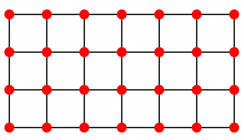

# 量子多目标组合优化赛题说明


## 1. 赛题背景

从繁忙的全球物流网络到毫秒必争的金融交易市场，我们的世界建立在无数复杂的决策之上。然而，现实世界中的决策从来不是单一维度的线性求解，而是一场在相互冲突的目标中寻求平衡的博弈。这就是多目标组合优化的核心困境：投资者渴望收益最大化，同时必须将风险降至最低；物流巨头力求缩短配送时间，却受到运输成本和车辆调度的严格制约。在这些场景中，不存在一个完美的“绝对最优解”，只存在一系列在不同目标间权衡取舍的“帕累托最优解”，这些解共同组成了该问题的帕累托前沿。

随着变量增加，问题的解空间呈指数级爆炸，要在天文数字般的可能性中精准定位帕累托前沿，是一个典型的 NP-Hard 难题。而量子计算凭借其独特的叠加与纠缠特性可在庞大解空间中进行并行搜索，量子采样的多样性很可能帮助我们更快地寻找帕累托前沿。本次黑客松比赛，我们将以多目标 Ising 能量最小化为目标，挑战利用量子计算快速寻找帕累托前沿。

## 2. 快速概览

本赛题包含两个任务：

- `main1()`：针对小规模 `5` 目标 Ising 问题，在固定量子采样预算下输出采样结果，并以最终 `HV` 相对基线的提升计分。
- `main2()`：针对大规模 Ising 问题，在保证 `HV` 与前沿输出正确的前提下，尽量加速经典后处理。

当前代码中的默认评测配置如下：

| 项目 | 当前配置 |
| --- | --- |
| `main1` 总预算 | `100000` shots |
| `main1` 基线 | `100` 个权重，每个 `1000` shots |
| `main1` 样例 `answer.py` | `3` 轮，分别为 `600 / 200 / 200` |
| `main2` 默认 shots | `200000` |
| 小规模 HV 参考点 | `ref = 1.01` |
| 小规模归一化 | 使用每个 case 的精确能量上下界 `(lo, hi)` |
| `main1` 分数权重 | `100000 × Score_5obj` |
| `main2` 分数权重 | `10 × Score_large_bonus_raw` |

提交时只需要提交 `answer.py`。

## 3. 问题定义

考虑一个 `a × b` 的格点图，每个顶点对应一个取值为 `+1/-1` 的自旋变量。



在同一个图拓扑上构造 `k` 个 Ising 目标：

$$
f^{(t)}(z)=\sum_i h_i^{(t)}z_i+\sum_{(i,j)\in E}J_{ij}^{(t)}z_iz_j,\quad t=1,\dots,k
$$

所有目标共享同一组自旋变量，但由于每个目标的边权和局部场不同，多个目标的最优解通常彼此冲突，因此问题的核心不是寻找单一最优点，而是寻找帕累托前沿。

赛题使用 `HV`（HyperVolume）评价前沿质量。


## 4. 提交接口

判题程序调用answer.py中的两个接口：

```python
def main1(problem_input, sample_budget=100000, rng_seed=None) -> dict:
    ...

def main2(problem_input, shots=200000, rng_seed=None, chunk_size=4096) -> dict:
    ...
```

### 4.1 `main1()` 返回要求

必须返回一个字典，至少包含：

- `sample_used`：实际总采样数，必须等于 `100000`
- `sample_spins`：形状为 `[sample_used, n_qubits]` 的 `-1/+1` 自旋矩阵

### 4.2 `main2()` 返回要求

必须返回一个字典，至少包含：

- `hv`：最终超体积
- `frontier_objectives_norm`：归一化前沿目标值
- `nd_count`：前沿点数量

## 5. 当前基线与样例方法

### 5.1 小规模 `main1` 基线

官方基线在 `baseline.py` 中：

| 项目 | 配置 |
| --- | --- |
| 轮数 | `1` |
| 权重数 | `100` |
| 每权重 shots | `1000` |
| 总 shots | `100000` |
| 量子线路 | 标准 QAOA |
| 权重池 | `data/w_pool_k5_n1000_seed2026.json` 的前 `100` 个 |

流程：

1. 读取固定权重池。
2. 对每个权重独立构造 QAOA 线路并采样。
3. 合并所有样本，计算最终前沿和 `HV`。

### 5.2 小规模 `main1` 样例 `answer.py`

当前样例方法在 `answer.py` 中：

| 项目 | 配置 |
| --- | --- |
| 轮数 | `3` |
| 权重数 | 每轮 `100` |
| 每轮每权重 shots | `600 / 200 / 200` |
| 总 shots | `100000` |
| warm-start | 开启 |
| warm 混合系数 | `c = 0.4` |

流程：

1. 第 1 轮按基线权重执行采样，但每个权重只采 `600` 次。
2. 对第 1 轮样本做经典筛选，提取非支配前沿并选出精英种子。
3. 用这些种子对第 2 轮对应权重执行 warm-start 采样。
4. 重复一次，进入第 3 轮。
5. 汇总三轮全部样本，计算最终 `HV`。


## 6. `main2` 当前说明

`main2()` 面向大规模案例，当前基线和样例都采用：

- 随机采样
- 分块计算 Ising 能量
- 增量维护非支配前沿
- 使用 `pygmo.hypervolume` 做精确 `HV`

默认评测 shots 为 `200000`。

## 7. 评分规则

总分由两部分组成：

- 小规模 `5` 目标主分
- 大规模 `main2` 附加分

公式为：

$$
Score_{5obj}=\frac{1}{|D_5|}\sum_{d\in D_5}\max(HV_d-HV_d^{base},0)
$$

$$
Score_{large\_bonus}^{raw}=\frac{1}{|D_L|}\sum_{d\in D_L}\max\left(\frac{T_d^{base}-T_d^{submit}}{T_d^{base}+\epsilon},0\right)
$$

$$
Score=100000\times Score_{5obj}+10\times Score_{large\_bonus}^{raw}
$$

可以直接理解为：

- `main1` 关心算法相比于基线关于 `HV`的增益
- `main2` 关心在结果一致前提下，计算速度比基线的提升
- 当前总分里，`main1` 是主项，`main2` 是附加项

## 8. 公平性与限制

### 8.1 `main1` 预算限制

- 固定总预算：`100000` shots
- 基线定义为 `100 × 1000`
- 提交算法的 `sample_used` 必须等于 `100000`（实际提供的采样串长度，如果 `sample_used` 不等于 100000，判分为0）

### 8.2 禁止事项

`main1()` 中不能使用经典算法直接改写或替代量子采样结果，例如（包括但不限于）：

- 穷举搜索
- 分支定界
- 整数规划
- 用经典方法直接修正量子输出样本

允许做的事情包括但不限于：

- 调整量子线路结构（不限制量子线路结构）
- 修改 warm-start 策略（不限制，使用任何量子策略均可）
- 调整轮数和采样分配
- 在量子样本产生之后做合法的前沿筛选与评估


`main2()` 只能优化数据处理方法，不能通过作弊的方法返回结果（包括但不限于）：
- 直接输入对应结果并返回
- 在main1中预先计算结果并由main2调用等

备注：main1的核心诉求是通过设计经典量子混合算法来提升求解质量，量子模块提供样本，经典处理部分不能产生新样本。main2是希望提升处理采样串的速度。违反上述规定一律取消成绩。

## 9. 数据集

当前仓库中对外可见的数据主要包括：

- `data/public`：公开小规模数据
- `data/large`：大规模数据

小规模数据当前是 `4×5` 网格、`5` 目标、`20` 比特问题。

## 10. 归一化与 HV 说明

### 10.1 小规模 `20` 比特 case

当前评测实现会先计算每个目标的精确最小值和最大值：

$$
lo_i=\min_x f_i(x),\quad hi_i=\max_x f_i(x)
$$

然后用

$$
\hat f_i(x)=\frac{f_i(x)-lo_i}{hi_i-lo_i}
$$

做归一化，再用 `ref = 1.01` 计算 `HV`。

这样做的原因是：将不同案例的HV计算归一化，避免HV的体积差距过大。

### 10.2 大规模 case

大规模问题不做全空间穷举，因此当前仍使用保守范围归一化。

## 11. 缓存说明

当前评测会使用两类缓存：

- `results/baseline_cache.json`
  - 小规模 baseline `HV`
  - 大规模 baseline 计时/HV
- `data/public/objective_extrema_cache.json`
  - 小规模公开案例的精确能量上下界缓存

这些缓存文件都不是提交内容，只用于减少重复评测开销。

## 12. 运行方式

常用命令：

```bash
python run.py --split public
python run.py --split all
```

常用参数：

- `--max-cases`：仅运行前若干个案例
- `--large-shots`：大规模附加分 shots，默认 `200000`
- `--out`：指定评测结果输出路径

## 13. 目录结构
隐藏数据集不展示
```text
hqs_moo/
├── answer.py
├── baseline.py
├── run.py
├── utils.py
├── README.md
├── transfer_data.csv
├── fig/
├── data/
│   ├── w_pool_k5_n1000_seed2026.json
│   ├── public/
│   ├── _hidden
│   └── large/
├── results/
│   ├── baseline_cache.json
│   └── latest_score.json
```

## 14. 提交说明

只需要上传answer.py文件，作品打成压缩包zip提交，压缩包命名格式为 hackathon-moo-团队名称.zip，注意保留前缀hackathon-moo，否则不判分。

## 15. 要求

1. 核心算法必须基于 MindSpore Quantum 量子计算框架实现。允许调用 MindSpore Quantum 算法库，或基于该框架编写自定义逻辑；
2. 程序在所有样例上的总运行时间不得超过 1 小时（运行环境：2核CPU，4GB内存）；
3. 所使用库可通过 pip 或者 conda 安装，不允许使用收费库。

## 16. 参考资料

- MindSpore Quantum QAOA 教学文档：
  https://www.mindspore.cn/mindquantum/docs/zh-CN/r0.12/case_library/quantum_approximate_optimization_algorithm.html
- 量子多目标优化相关文章：`arxiv.XXXX`（后续补充）
- 量子多目标优化相关文章：https://www.nature.com/articles/s43588-025-00873-y
